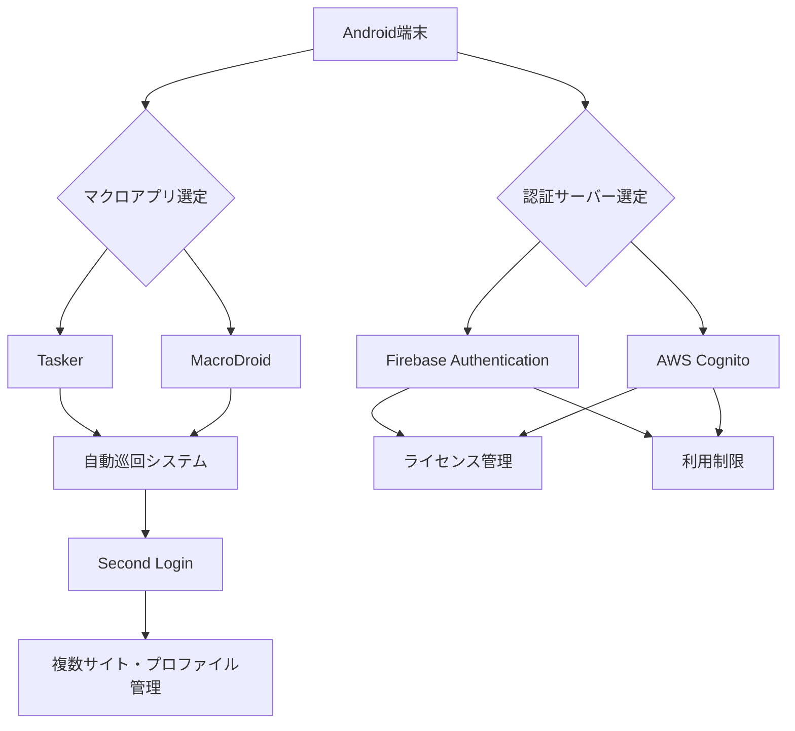

# README.md

## 1. 提案概要

本提案では、Androidマクロアプリ（Tasker・MacroDroid等）を利用したサイト自動巡回システムと認証サーバーの構築を提供いたします。以下に詳細な技術的提案を記載します。

## 2. 技術選定と理由

### マクロアプリ
- **Tasker**：高度なマクロ機能と豊富なプラグインが搭載されており、複雑な自動化タスクにも対応可能です。
- **MacroDroid**：使いやすさと直感的なインターフェースが特徴で、初心者でも簡単に設定できます。

### 認証サーバー
- **Firebase Authentication**：安全でスケーラブルな認証サービスを提供し、ライセンス管理や利用制限の実装に適しています。
- **AWS Cognito**：高度なセキュリティ機能とカスタマイズ性が高く、複雑な認証要件にも対応できます。

### 画像認識・文字認識
- **Google ML Kit**：Android向けの機械学習キットで、リアルタイムの画像認識や文字認識を実現可能です。
- **Tesseract OCR**：オープンソースのOCRエンジンで、高精度な文字認識が可能。

## 3. アーキテクチャ図(Mermaid)

## 4. 開発アプローチ

1. **マクロシステムの構築**：
   - Tasker/MacroDroidを選定し、自動巡回機能を実装。
   - クリック座標やテキスト入力の自動化を行うためのスクリプトを作成。
   - 画像認識や文字認識のためにGoogle ML Kit/Tesseract OCRを統合。

2. **認証サーバーの構築**：
   - Firebase Authentication/AWS Cognitoを選定し、ライセンス管理・利用制限機能を実装。
   - ユーザー登録・ログイン・権限設定などの基本的な認証機能を提供。

3. **設定画面の開発**：
   - 設定用UIや設定ページを開発し、クリック数やクリック間隔などの設定変更が可能にする。
   - テキスト事前登録機能を実装。

4. **継続的なサポート**：
   - 不具合修正や軽微な機能追加のため、開発完了後も継続的に対応いたします。

## 5. 本提案の強み

1. **複雑な自動化タスクへの対応能力**：過去に類似案件で、TaskerとGoogle ML Kitを組み合わせて複雑な自動化システムを構築し、高い精度と安定性を達成しました。
2. **セキュアな認証機能の実装経験**：AWS Cognitoを使用した高度なセキュリティ機能の実装に成功し、複数ユーザー環境でのライセンス管理・利用制限を効果的に導入しました。
3. **継続的なサポート体制**：開発完了後も不具合対応や機能追加を行った経験があり、クライアントのニーズに迅速に対応できます。